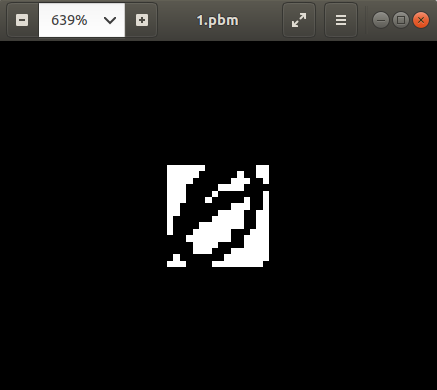
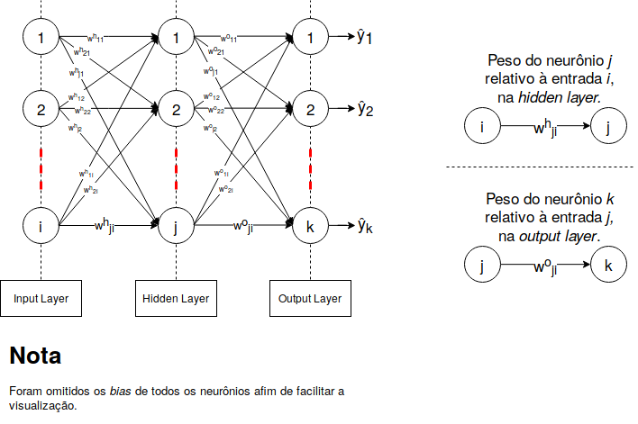
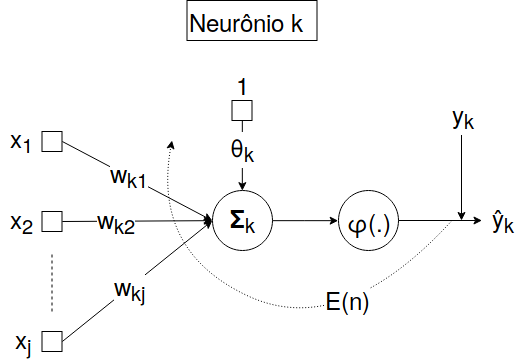
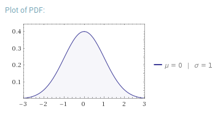

# Multilayer Perceptron
---

Antonio Moreira - nUSP: 9779242

## Objetivo
Desenvolver a arquitetura de uma **rede neural aritifical** usando o modelo **Multilayer Perceptron** que seja capaz de reconhecer dígitos escritos à mão de um *dataset* fornecido.


## Dataset
O [conjunto de dados](https://archive.ics.uci.edu/ml/datasets/semeion+handwritten+digit) econtra-se disponível no site [UCI - Machine Learning Repository](https://archive.ics.uci.edu/ml/index.php) e contém 1593 amostras de dígitos escritos a mão por 80 pessoas, que então foram digitalizados e recortados em uma imagem *gray scale* de 16*x*16 pixels. Cada imagem está associada à uma classe que representa o valor numérico do dígito correspondente, pois, neste projeto, lidamos com __aprendizado supervisionado__.

**Exemplo: *imagem 1.pbm* :** 

*P1* <br>
*16 16* <br>
*0 0 0 0 0 0 1 1 1 1 1 1 1 1 0 0* <br>
*0 0 0 0 0 1 1 1 1 1 1 0 1 1 0 0* <br>
*0 0 0 0 1 1 1 1 1 1 0 0 0 1 1 0* <br>
*0 0 0 1 1 1 1 1 0 0 0 0 1 1 1 1* <br>
*0 0 0 1 1 1 1 0 1 1 1 1 1 1 1 0* <br>
*0 0 0 1 1 1 0 1 1 1 1 1 0 1 1 0* <br>
*0 0 1 1 1 1 1 1 1 1 0 0 0 1 1 0* <br>
*0 0 1 1 1 1 1 1 0 0 0 0 1 1 0 0* <br>
*0 1 1 1 1 1 1 0 0 0 0 0 1 1 0 0* <br>
*0 1 1 1 1 0 0 0 0 0 0 0 1 1 0 0* <br>
*0 1 1 1 0 0 0 0 0 0 1 1 1 0 0 0* <br>
*1 1 1 0 0 0 0 0 0 0 1 1 0 0 0 0* <br>
*1 1 1 1 0 0 0 0 1 1 1 1 0 0 0 0* <br>
*1 1 1 1 0 0 0 1 1 1 0 0 0 0 0 0* <br>
*1 0 1 1 1 1 1 1 1 0 0 0 0 0 0 0* <br> 

> - **P1**: *Magic Number*, indica que a imagem é _Portable BitMap_, ou seja, que só recebe valores 0 (branco) e 1(preto).<br>
> - **16 16**: números que indicam a dimensão da imagem (_linha_ e _coluna_, respectivamente).<br>
> - **Valores**: 16 linhas com 16 valores representando os pixels da imagem.<br>

Visualização da imagem ampliada:


A imagem acima representa uma das 1593 amostras do conjunto de dados, no entanto, para facilitar o processamento, as imagens foram vetorizadas. Portanto, cada linha do conjunto de dados contém: 
> - A imagem vetorizada em 256 valores.
> - Classe associada, que é um vetor binário com 10 posições onde a primeira posição representa o dígito zero e última o dígito nove. <br> **Ex**: O valor zero está associado à classe *1 0 0 0 0 0 0 0 0 0*, enquanto o valor um está associado à classe *0 1 0 0 0 0 0 0 0 0*.

## Aspectos de Implementação

O projeto foi dividido em dois arquivos _Python 3_:
* __mlp.py__: Contém a implementação do Multilayer Perceptron.
* __main.py__: Realiza o préprocessamento de dados e a validação de resultados invocando a _mlp.py_. 

## Linguagem e Bibliotecas
---
Este projeto foi realizado usando _Python 3_ devido a familiaridade com a linguagem. Para implementação do algoritmo em si (_MLP_) foi usada somente a biblioteca [NumPy](http://www.numpy.org/), que lida com manipulações numéricas e de matrizes e vetores n-dimensionais. No entanto, alguns métodos adcionais necessitaram ser utilizadas para validação/verificação de resultados, tais métodos foram importados da biblioteca [scikit-learn](https://scikit-learn.org/stable/). 


```python
import numpy as np
from sklearn.model_selection import KFold
from sklearn.metrics import accuracy_score
from sklearn.model_selection import train_test_split

np.random.seed(42)
```

## Pré-processamento dos dados
---
Nesta etapa, serão lidas as 1593 linhas do conjunto de dados e, então, separadas em dois conjuntos:
* _features_ : Conjunto X.
* _labels_  : Conjunto Y.

A função recebe uma string com o caminho para o conjunto de dados em questão e faz um split em cada linha do arquivo, realizando um _cast_ para float. Em seguida, retorna os conjuntos com o tipo _nd.array_.


```python
def preProcessing_Data(path):
    fp = open(path, 'r')

    X = [] # features
    Y = [] # labels

    for i in fp:
        X.append(list(map(float, i.split()[:-10])))  #slicing inputs
        Y.append(list(map(float, i.split()[-10:])))  #slicing training classes

    fp.close()

    return (np.array(X, dtype=float),np.array(Y, dtype=int))
```


```python
(X,Y) = preProcessing_Data("./data/semeion.data")
```

## MLP
---
Para uma boa estruturação da explicação da implementação, esta seção do documento será estruturada da seguite forma:
1. [Detalhando um Neurônio](#neuronio)
2. [\_\_init\_\_](#init)
3. [Inicialização de Pesos](#pesos)
4. [FeedForward](#FeedForward)
5. [Função de ativação](#ativacao)
6. [Backpropagation](#Backpropagation)
7. [Predict](#Predict)

Além disso, tomaremos a seguinte imagem para exemplificar um modelo genérico de _MLP_:



### Detalhando um Neurônio <a name="neuronio"></a>
Um nerônio _k_ qualquer é visto da seguinte forma:



Este neurônio recebe _j_ entradas e fixamente o valor 1, em seguida, realiza uma combinação linear com os respectiovos pesos e o bias θ, da seguinte forma:

$ x = [x_1, x_2, ..., x_j, 1] \quad $ **Vetor de entrada + $x_{j+1}=1$.**

$w = [w_{k1},w_{k2}, ..., w_{kj}, θ] \quad$ **Vetor de pesos + bias = $w_{k(j+1)}=θ$.**

$net_k = \displaystyle\sum_{n=0}^{j+1} x_n \cdot w_{kn} \quad$ **Combinador linear**

O valor calculado em $net_k$ é então aplicado à uma função de ativação definida pelo usuário:

$ŷ_k = f\_net_k = \varphi(net_k)$

No esquema representado pela imagem, o valor do erro no neurônio _k_ no n-ésimo instante, que posteriormente será usado para realizar o *backpropagation*, é definido por:

$E_k(n) = (y_k - ŷ_k)²$


### \_\_init\_\_ <a name="init"></a>
A função de inicialização do objeto MLP, _seta_ os parâmetros gerais da rede neural:
+ __X__: conjunto com as features de treinamento, neste caso, uma matriz (1593, 256).
+ __Y__: conjunto com as labels, neste caso, uma matriz (1593, 10).
+ __iL_size__: número de elementos (**i**) na _Input Layer_, recebe o número de colunas do _array_ X, neste caso, 256. Vale ressaltar que a _Input Layer_ não contém neurônios, somente propagam as entradas que recebem.
+ __hL_size__: número de neurônios (**j**) na _Hidden Layer_, haverá variação deste número para avaliar resultados, _default_ é 2.
+ __oL_size__: número de neurônios (**k**) na _Output Layer_, neste caso é igual a 10, _default_ é 1.
+ __activationFunc__: função de ativação que será utilizada nos neurônios, será explicada mais detalhadamente adiante, _default_ é **sigmoid**.
+ __eta__: parâmetro de aprendizado $\eta$, _default_ $10^{-2}$.
+ __n_epochs__: número de épocas, controla o número máximo de iterações no conjunto de dados, _default_ 500.
+ __threshold__: parâmetro do erro, _default_ $10^{-2}$.
+ __hL_Weights__: matriz com os pesos de todos os neurônios da _Hidden Layer_.
+ __oL_Weights__: matriz com os pesos de todos os neurônios da _Output Layer_.

Quando o construtor da MLP é chamado, ele invoca a função de inicialização de pesos para os dois últimos parâmentros citados acima. Note que, no parâmetro de coluna, a inicialização é feita somando 1 ao valor, isto é feito para considerar o _bias_ de cada neurônio.


### Inicialização de Pesos  <a name="pesos"></a>
A função de inicializaçaõ de pesos *init_Weights* simplesmente recebe dois números (**row** e **col**) inteiros e inicializa uma matriz com dimensão $row \times col$, com números aleótrios. Os números têm distribuição normal padronizada, i.e., com média zero e variância 1, além disso, são multiplicados por um fator de $10^{-4}$, pois, deste modo, não saturarão a função de ativação no feedforward.

A distribuição normal, com média $\mu$ e variância $\sigma$ é dada por:

$$ \mathscr{N}(x, \mu, \sigma) = \frac{1}{\sigma \cdot \sqrt{2 \cdot \pi}} \cdot \exp{\frac{-(x-\mu)²}{2 \cdot \sigma²}}$$

Padronizano a distribuição, i.e., tomando $\mu = 0$ e $\sigma = 1$ temos que:

$$ \mathscr{N}(x, 0, 1) = \frac{1}{\sqrt{2 \cdot \pi}} \cdot \exp{\frac{-(x)²}{2}}$$

O gráfico da *probability density function*, gerado pelo [Wolfram Alpha](https://www.wolframalpha.com/) é dado por:



### FeedForward
A função de **FeedForward** consiste na combinação linear de uma dada amostra (vetor de entrada) com uma matriz de pesos sinápticos fornecida, i.e., pesos da Output Layer ou Hidden Layer, da seguinte forma:

$S(n) = [s_1(n), s_2, ..., s_j] \quad$ **Amostra no instante _n_ com _j_ elementos**

O número _1_ será fixado (através de um _append_) no final do vetor _s_ para representar multiplicar o *bias*, portanto:

$S(n) = [s_1(n), s_2, ..., s_j, 1] \quad$ **Amostra no instante _n_ com _j_ elementos + 1**

A matriz de pesos, no instante _n_, com dimensões, $i \times (j+1)$ é dada por:

$$
W(n) = \left(
    \begin{array}{cccc|c}
        w_{1,1}(n) & w_{1,2}(n) & \cdots & w_{1,j}(n) & \theta_1(n) \\
        w_{2,1}(n) & w_{2,2}(n) & \cdots & w_{2,j}(n) & \theta_2(n) \\
        \vdots  & \vdots  & \ddots & \vdots  & \vdots \\
        2_{i,1}(n) & X_{i,2}(n) & \cdots & w_{i,j}(n) & \theta_i(n)
    \end{array}
\right)
$$

> Note que a última coluna contém o bias de cada neurônio.

Desta forma, o resultado do combinador linear, no instante _n_, é dado por:

$$ net(n) = W(n) \cdot S(n)^{T} $$

> Note que o $net(n)$ é um vetor com _i_ posições, representando o valor de saída de cada neurônio.

Por fim, a função retorna os valores de _net_ aplicado à função de ativação (a função de ativação preserva a dimensão do vetor anterior).
$$ŷ = f\_net = \varphi(net(n))$$

### Função de Ativação <a name="ativacao"></a>
A função de ativação $\varphi$ é definida sendo a _sigmóide_ como padrão, no entanto o usuário é livre para difinir sua própria função de ativação se estabelecer também a derivada da mesma. 

Segue a função e sua respectiva derivada: 
$$ sig(t) = \frac{1}{1+e^{-t}} $$
$$ \frac{\mathrm d sig(t)}{\mathrm d t} = sig(t) \cdot (1-sig(t)) $$


> **NOTA**: na inicialização de pesos, todos os pesos foram multplicados por um fator de $10^{-4}$, a justificativa pode ser entendida aqui. Podemos notar que para valores muito altos a função tende a 1, saturando-a, para evitar este tipo de comportamento os pesos são diminuidos.


### Backpropagation
A etapa de **Backpropagation** é responsável por atualizar os pesos sinápticos de cada neurônio, incluindo o bias, buscando encontrar a melhor representação da rede que soluciona o problema em questão.

A função itera sobre um conjunto de fornecidos, normalmente conhecido como _conjunto de treino_, até atingir um limiar de erro (**threshold**) ou o número de épocas (**epochs**), o número de épocas nada mais é que o número de vezes que todo o conjunto de treinamento é usado para treinar a rede, estas verificações são realizadas no **laço externo**. O erro é inicializado duas vezes maior que o threshold e o número de épocas em zero.Segue o trexo de código:

```python
# ↓ laço externo
while(squaredError > self.threshold and epoch < self.n_Epochs):
    # squaredError > self.threshold: representa o limiar de erro
    # epoch < self.n_Epochs:         representa o número de épocas
    
    # ↓ laço interno
    for i in self.X:
        # iterando sobre todo conjunto de dados
```

> **NOTA**: a variável $n\_Epochs$ é usada para controlar a convergência do algoritmo, i.e., se o backpropagation "_ficar preso_" num mínimo local maior que o threshold, o algoritmo não irá convergir (ou demorará muito tempo), deste modo ao passar pelo conjunto de treinamentos $n\_Epochs$ vezes a função retornará com o menor erro encontrado. 


No **laço interno** é onde ocorrre, de fato, o backpropagation. Para cada amostra _i_ do conjunto de treinamento, é realizado o FeedForward, passando pela camada escondida e pela camada de saída, gerando portanto dois vetores de resultados:
+ $f_{net}^{hL} $ : resultado da hidden layer
+ $f_{net}^{oL} $ : resultado da output layer

Em seguida, é calculado o erro (Mean Squared Error) e sua derivada nas condições atuais da rede.

$$ MSE(y,ŷ) = (y-ŷ)² $$

$$ \frac{\partial{MSE(y,ŷ)}}{\partial{ŷ}} = (y-ŷ)$$

> **NOTA**: o valor (-2) foi tirado da derivada para fim de simplificação (o erro quadrático instatâneo será definido a seguir).

A atualização de um peso genérico (peso no neurônio $k$ relativo a entrada $j$) da **Output Layer** é feita da seguinte maneira:

$$ w_{kj}^{o}(n+1) = w_{kj}^{o}(n) - \eta \cdot 
            \frac{\partial{\mathscr{E}(n)}}{\partial{w_{kj}^{o}}} $$

O erro instantâneo total $\mathscr{E}(n)$ é definido como sendo a soma de todos os erros, ao quadrado, dos neurônios da camada de saída:

$$ \mathscr{E}(n) = \frac{1}{2} \cdot \displaystyle\sum_{\forall{k} \in \mathscr{O}} e²_k(n) $$

O erro no neurônio $k$ no instante $n$ é dado pela diferença entre o valor esperado menos o valor obdito, no mesmo instante:
$$ e_k(n) = y_k(n) - ŷ_k(n) $$

A derivada parcial do erro instantâneo com respeito ao peso sinámptico $w_{kj}$ é dada por:

$$ \frac{\partial \mathscr{E}(n)}{\partial w^{o}_{kj}(n)} =
    \displaystyle\sum_{\forall{k} \in \mathscr{O}}
    \frac{\partial \mathscr{E}(n)}{\partial ŷ^{o}_k(n)} \cdot
    \frac{\partial ŷ^{o}_k(n)}{\partial net^{o}_k(n)} \cdot
    \frac{\partial net^{o}_k(n)}{\partial w^{o}_{kj}(n)} $$

> **NOTA**: O conjunto $\mathscr{O}$ no somatório refere-se aos neurônios da camada de saída. Além disso, é trivial notar que se a atualização está sendo feita com respeito ao peso sináptico $w^{o}_{kj}(n)$ os pesos restantes do somátório serão zerados na derivada parcial.

Resultando em:
$$ \frac{\partial \mathscr{E}(n)}{\partial w^{o}_{kj}(n)} = 
    -(y_k(n) - ŷ^{o}_k(n)) \cdot
    (ŷ^{o}_k(n) \cdot (1-ŷ^{o}_k(n)) \cdot
    ŷ^{h}_j(n) $$
    
> **NOTA**: $ŷ^{h}_j(n)$ é o valor obtido pelo neurônio $j$ na hidden layer.

Por fim,

$$ w_{kj}^{o}(n+1) = w_{kj}^{o}(n) + \eta \cdot 
        (y_k(n) - ŷ^{o}_k(n)) \cdot
        (ŷ^{o}_k(n) \cdot (1-ŷ^{o}_k(n)) \cdot
        ŷ^{h}_j(n) $$
        
No caso do *bias*,

$$ \theta_{kj}^{o}(n+1) = \theta_{kj}^{o}(n) + \eta \cdot 
        (y_k(n) - ŷ^{o}_k(n)) \cdot
        (ŷ^{o}_k(n) \cdot (1-ŷ^{o}_k(n)) \cdot 1 $$


De forma análoga, a atualização de um peso genérico (peso do neurônio $j$ relativo a entrda $i$) na **Hidden Layer** é feita da seguinte maneira:

$$ w_{ji}^{h}(n+1) = w_{ji}^{h}(n) - \eta \cdot 
            \frac{\partial{\mathscr{E}(n)}}{\partial{w_{ji}^{h}}} $$
            
A derivada parcial, neste caso, é dada por:

$$ \frac{\partial \mathscr{E}(n)}{\partial w^{h}_{ji}(n)} =
    \displaystyle\sum_{\forall{k} \in \mathscr{O}}
    \frac{\partial \mathscr{E}(n)}{\partial ŷ^{o}_k(n)} \cdot
    \frac{\partial ŷ^{o}_k(n)}{\partial net^{o}_k(n)} \cdot
    \frac{\partial net^{o}_k(n)}{\partial ŷ^{h}_j(n)} \cdot 
    \frac{\partial ŷ^{h}_j(n)}{\partial net^{h}_j(n)} \cdot 
    \frac{\partial net^{h}_j(n)}{\partial w^{h}_{ji}(n)} $$

Resultando em:
$$ \frac{\partial \mathscr{E}(n)}{\partial w^{h}_{ji}(n)} =
    -\Bigg(\displaystyle\sum_{\forall{k} \in \mathscr{O}}
    (y_k(n) - ŷ^{o}_k(n)) \cdot
    (ŷ^{o}_k(n) \cdot (1-ŷ^{o}_k(n)) \cdot
    w^{o}_{kj}(n) \Bigg) \cdot 
    (ŷ^{h}_j(n) \cdot (1-ŷ^{h}_j(n)) \cdot 
    x_i(n) $$
    
> **NOTA**: $x_i(n)$ refere-se ao valor que entra no neurônio $i$ no instante $n$.

Por fim, 

$$ w_{ji}^{h}(n+1) = w_{ji}^{h}(n) + \eta \cdot 
    \Bigg(\displaystyle\sum_{\forall{k} \in \mathscr{O}}
    (y_k(n) - ŷ^{o}_k(n)) \cdot
    (ŷ^{o}_k(n) \cdot (1-ŷ^{o}_k(n)) \cdot
    w^{o}_{kj}(n) \Bigg) \cdot 
    (ŷ^{h}_j(n) \cdot (1-ŷ^{h}_j(n)) \cdot 
    x_i(n) $$

De modo geral, a atualização de um peso qualquer numa rede com múltiplas camadas escodidas é dado por:

$$ \Big( \Delta w_{ji}(n) \Big) = \Big( \text{Parâmetro de Aprendizado } \eta \Big) \cdot
                                    \Big( \text{Gradiente Local } \delta_j(n) \Big) \cdot
                                    \Big( \text{Sinal de entrada de j } x_i(n) \Big)$$ 


### Predict

A função *predit* faz uso da capacidade de generalização da MLP após realizar o treinamento com a função de _backpropagation_. Ela recebe uma amostra, realiza o _Feedforward_, passando pela Hidden e Output Layer. Com o vetor de resposta da última camada, a função busca o maior valor e atribui o valor 1, os outros valores tornam-se zero.

Segue um exeplo:

**exemplo** = [0.123, 0.87123, 0.989, 0.0534, 0.234, 0.7851, 0.9123, 0.135, 0.534, 0.702]

Neste caso, maior valor é 0.989, portanto o resultado retornado é:

**retorno** = [0, 0, 1, 0, 0, 0, 0, 0, 0, 0]

Portanto, a rede predisse que a amostra fornecida é o número 2.


```python
class MLP:
    def sigmoid(self, x, derivate=False):
        return 1/(1+np.exp(-x)) if not(derivate) else (x*(1-x))

    def init_Weights(self, row, col):
        # Gera valores aleatórios com distribuição normal padronizada (i.e., com média 0 e var 1)
        return (np.random.standard_normal(size=(row, col))*1e-4)
    
    def feedForward(self, weight, X):
        if(np.shape(weight)[1]-1 != len(X)):
            return -1

        X = np.append(X, 1)
        net = np.dot(weight, np.transpose(X))
        
        return self.activationFunc(self, net)

    # Mean Squared Error
    def MSE(self, y, f_net, derivate=False):
        return sum(pow(y-f_net, 2)) if not(derivate) else (y-f_net)

    def backpropagation(self):
        squaredError = 2*self.threshold
        epoch = 0
        
        while(squaredError > self.threshold and epoch < self.n_Epochs):
            squaredError = 0 # ←←←←← tirar isso pra ver se converge
            
            row = 0
            for i in self.X:
                # » Forward pass
                f_net_hL = self.feedForward(self.hL_Weights, i)         # Feed Hidden Layer
                f_net_oL = self.feedForward(self.oL_Weights, f_net_hL)  # Feed Output Layer

                # Erro
                squaredError += self.MSE(self.Y[row], f_net_oL) # erro(esperado, obtido)
                d_squaredError = self.MSE(self.Y[row], f_net_oL, True) #derivada do MSE
                
                # » Backward pass
                old_oL_Weights = self.oL_Weights # para usar no ajuste da hidden layer
                
                # → Ajustando oL_Weights
                localGrd = np.multiply(d_squaredError, self.activationFunc(self, f_net_oL, True))
                self.oL_Weights += self.eta * np.multiply(np.transpose([localGrd]), np.append(f_net_hL, 1)) 

                # → Ajustando hL_Weights:
                localGrd = (localGrd @ old_oL_Weights[...,:-1]) * self.activationFunc(self, f_net_hL, True)
                self.hL_Weights += self.eta * np.transpose([localGrd]) * np.append(i, 1)

                row += 1
            
            squaredError /= np.shape(self.X)[0] # MSE = MSE/N (Energia média do erro quadrático)
            epoch += 1
    
    def predict(self, sample):
        f_net_hL = self.feedForward(self.hL_Weights, sample)
        f_net_oL = self.feedForward(self.oL_Weights, f_net_hL)

        maximum = np.argmax(f_net_oL)

        for i in range(len(f_net_oL)):
            if (i != maximum):
                f_net_oL[i] = 0
            else:
                f_net_oL[i] = 1
        return np.array(f_net_oL, dtype=int)
    
    def __init__(self, X, Y, hL_size = 2, oL_size = 1, activationFunc = sigmoid, eta = 1e-2, 
                 n_Epochs = 5e2, threshold = 1e-2):
        self.iL_size = np.shape(X)[1]
        self.hL_size = hL_size
        self.oL_size = oL_size
        self.activationFunc = activationFunc
        self.eta = eta
        self.n_Epochs = n_Epochs
        self.threshold = threshold
        
        if(np.shape(X)[0] == np.shape(Y)[0]):
            (self.X, self.Y) = (X, Y)
        else:
            print("X and Y must be same row lenght")
        
        self.hL_Weights = self.init_Weights(self.hL_size, self.iL_size+1)
        self.oL_Weights = self.init_Weights(self.oL_size, self.hL_size+1)      
```

## Verificando o impacto do número de neurônios na Hidden Layer

Nesta etapa será verificado como o número de neurônios na camada escondida impacta o resultado da rede.

Inicialmente o conjunto de dados é dividido em quatro partes:
+ **X_train**: conjunto de entradas para treinamento;
+ **X_test**: conjunto de entradas para verificação de resultados (predição);
+ **Y_train**: conjunto de classes esperadas para treinamento;
+ **Y_test**: conjunto de classes esperadas para verificação de resultados.

Em seguida a variável _sizeHidden_, que representa o número de neurônios na camada escondida, é inicializada com o valor de 30 e incrementada de 10 em 10 até atingir o valor 100. Para cada valor da variável a rede é treinada e o score é calculado. Buscamos o melhor número de neurônios na camada escondida a partir da verificação do score.

Após o treinamento da rede, para um dado número de neurônios na camada escondida, o **score** é calculado usando a porcentagem de acertos para o conjunto $X_{test}$ em relação ao esperado $Y_{test}$.


```python
X_train, X_test, Y_train, Y_test = train_test_split(X, Y, test_size=0.33, random_state=42)

sizeHidden = 30

while(sizeHidden <= 100):
    mlp = MLP(X_train, Y_train, hL_size=sizeHidden, oL_size = 10)
    mlp.backpropagation()

    Y_pred = []
    
    for i in X_test:
        Y_pred.append(mlp.predict(i))
        
    score = accuracy_score(Y_test, np.array(Y_pred))
    
    print("Nº de neurônios: %d | Score: %f " % (sizeHidden, score))
    
    sizeHidden += 10
```

    Nº de neurônios: 30 | Score: 0.912548: 
    Nº de neurônios: 40 | Score: 0.910646: 
    Nº de neurônios: 50 | Score: 0.920152: 
    Nº de neurônios: 60 | Score: 0.920152: 
    Nº de neurônios: 70 | Score: 0.912548: 
    Nº de neurônios: 80 | Score: 0.916350: 
    Nº de neurônios: 90 | Score: 0.914449: 
    Nº de neurônios: 100 | Score: 0.914449: 


## Verificando o impacto do parâmetro de aprendizado

Na etapa anterior notamos que o melhor *Score* obtido foi de $0.920152$ para 50 e 60 neurônios na camada escondida, nesta etapa iremos utilizar 50 neurônios para verificação de resultados.

A partir de $\eta = 10^{-4}$ treinaremos a rede, verificando os resultados obitidos, multiplicando por um fator de 10 a cada iteração.

> **Valor normal para $\eta$**: $10^{-2}$ <br> 
> **Valor pequeno para $\eta$**: $10^{-4}$ <br>
> **Valor alto para $\eta$**: $1$ 


```python
X_train, X_test, Y_train, Y_test = train_test_split(X, Y, test_size=0.33, random_state=42)
eta_aux = 1e-4

while(eta_aux <= 1):
    mlp = MLP(X_train, Y_train, hL_size=50, oL_size = 10, eta=eta_aux)
    mlp.backpropagation()

    Y_pred = []
    
    for i in X_test:
        Y_pred.append(mlp.predict(i))
        
    score = accuracy_score(Y_test, np.array(Y_pred))
    
    print("Eta: %f | Score: %f" % (eta_aux, score))
    
    eta_aux *= 1e+2
```

    Eta: 0.000100 | Score: 0.083650
    Eta: 0.010000 | Score: 0.916350
    Eta: 1.000000 | Score: 0.283270


Com os resultados acima é fácil notar que valores extremos (baixos ou altos) para o passo de aprendizado $\eta$ prejudicam o treinamento da rede, gerando uma acurácia baixíssima.

## Utilizando K-Fold

Nesta etapa será verificado o impacto de utilizarmos **10-Fold** para validação dos dados, este algoritmo _splita_ os dados randomicamente entre teste e treino para realizarmos o treinamento e verificação de resultados.

Este método é útil pois, como as classes estão distribuidas de modo sequencial, i.e., todos os dígitos zeros são seguidos pelos dígitos um e assim por diante até o dígito nove, isto pode geral inconsitência na etapa de testes com _overfitting_ ou _underfitting_ dependendo do comportamento interno da rede. Com a separação aleatória dos dados este comportamento pode ser evitado


```python
kf10 = KFold(n_splits=10)

for train_idx, test_idx in kf10.split(X):
        X_train, Y_train = X[train_idx], Y[train_idx]
        X_test, Y_test = X[test_idx], Y[test_idx]

        mlp = MLP(X_train, Y_train, hL_size=50, oL_size=10)
        mlp.backpropagation()
        
        Y_pred = []

        for i in X_test:
            Y_pred.append(mlp.predict(i))
    
        score = accuracy_score(Y_test, np.array(Y_pred))
        print("Score: ", score)
```

    Score:  0.95
    Score:  0.9375
    Score:  0.89375
    Score:  0.9371069182389937
    Score:  0.9245283018867925
    Score:  0.9433962264150944
    Score:  0.9433962264150944
    Score:  0.9056603773584906
    Score:  0.89937106918239
    Score:  0.89937106918239

